 
 
# 数字图像处理课程作业实验五

**张程博昊**

**自动化64**

**2160504106**

**2019年3月31日**

## 摘要
此次实验主要设计应用了频域的各种高通、低通滤波器，对不同图像分别进行了平滑、边缘增强处理。并对不同的滤波器进行比较，分析了其优缺点及适用范围。通过这次实验，对频域滤波有了更深入的了解。

## 实验内容

### 1.频域低通滤波器：设计低通滤波器包括 butterworth and Gaussian (选择合适的半径，计算功率谱比),平滑测试图像test1和2;分析各自优缺点；

在MATLAB中借用fft2(),fftshift（）等函数，编写出两种低通滤波器，得出结果如下：

高斯低通滤波器：

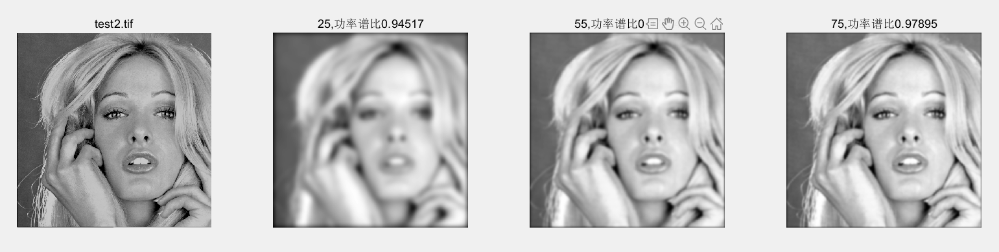

巴特沃斯低通滤波器：

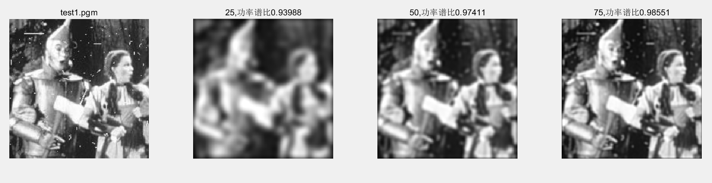

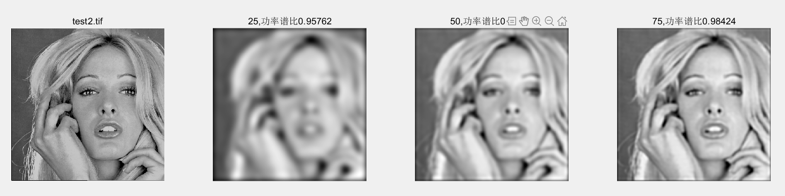

**优缺点：**

对test1、test2两张图片分别用高斯低通滤波器、巴特沃斯低通滤波器进行处理，并分别使用不同的的半径，在此使用25、50、75三种不同的半径。通过对结果的分析，得到以下结论：

1.对于同种滤波器，在半径较小时，图片较为模糊，当半径增大时，图片逐渐清晰。并且随着半径的增大，功率谱比逐渐增大，即包含更多的低频分量。

2.对于不同种滤波器，可以看出两者效果基本一致，均有平滑作用，但视觉看来巴特沃斯低通滤波器平滑作用更为明显，图片也更为模糊。

### 2.频域高通滤波器：设计高通滤波器包括butterworth and Gaussian，在频域增强边缘。选择半径和计算功率谱比，测试图像test3,4：分析各自优缺点；

在MATLAB中借用fft2(),fftshift（）等函数，编写出两种低通滤波器，得出结果如下：
 
高斯高通滤波器：

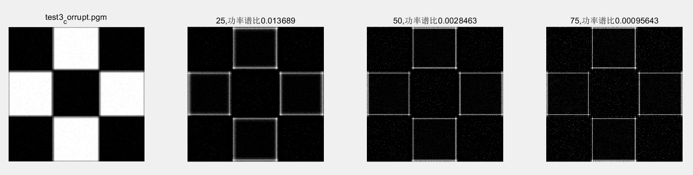

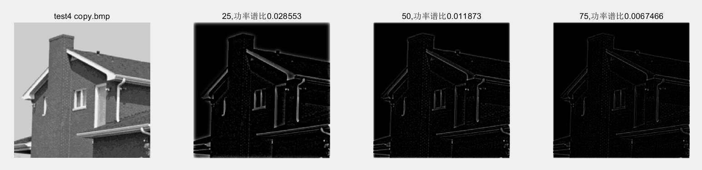

巴特沃斯高通滤波器：

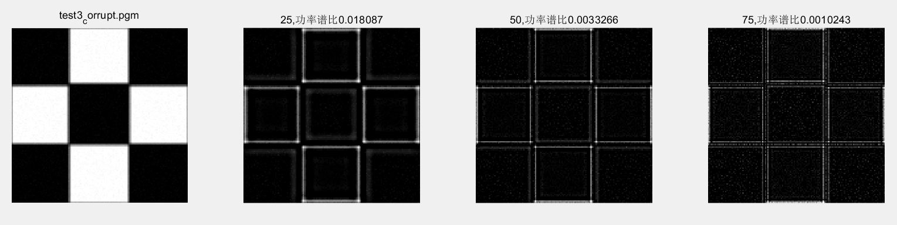

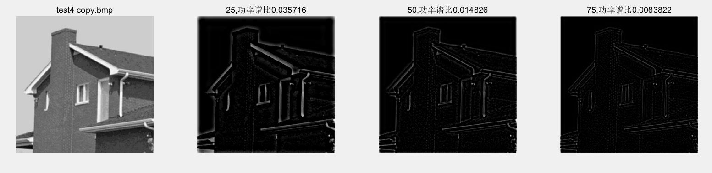

**优缺点：**
对test3、test4两张图片分别用高斯高通滤波器、巴特沃斯高通滤波器进行处理，并分别使用不同的的半径，在此使用25、50、75三种不同的半径。通过对结果的分析，得到以下结论：

1.对于同种滤波器，在半径较小时，边缘较为清晰，当半径增大时，图片逐渐模糊。并且随着半径的增大，功率谱比逐渐减小，即包含更少的高频分量。

2.对于不同种滤波器，可以看出两者效果基本一致，均有突出边缘的作用，可以看出巴特沃斯滤波器太过灵敏，对一些非边缘处理错误。而高斯滤波器处理较好，但边缘没有巴特沃斯高通滤波器清晰
 

### 3.其他高通滤波器：拉普拉斯和Unmask，对测试图像test3,4滤波；分析各自优缺点；

通过对算法的原理的学习，用MATLAB编写了USM、Laplace滤波器，结果如下:

laplace高通滤波器：
 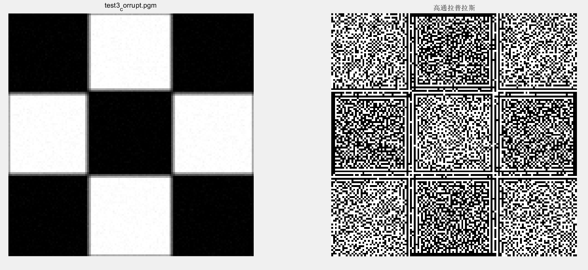
 
 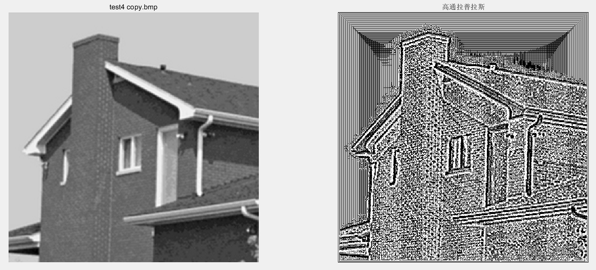

USM高通滤波器：
 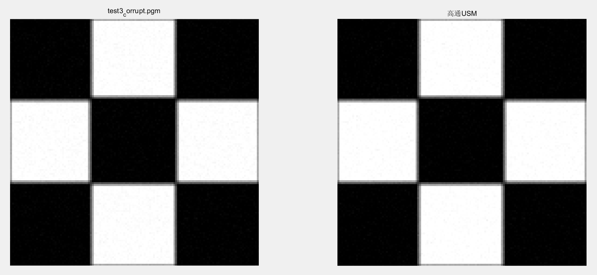
  
 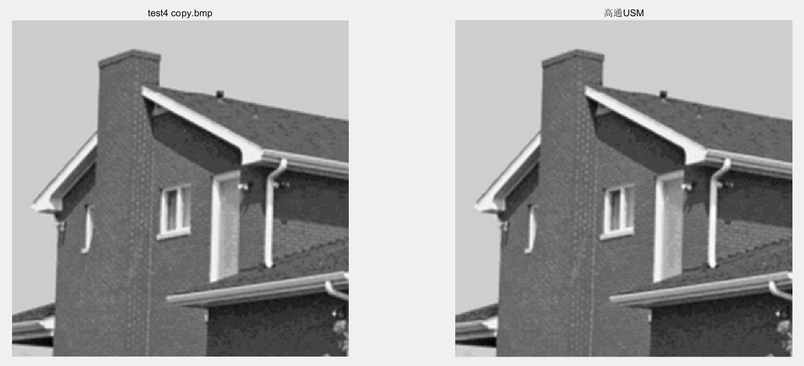
 
**结果分析：**
根据以上图片，可以得出以下结论：

USM处理：得到了边缘较清晰的图像，但边缘线较粗。

laplace：边缘线较细，效果较差，对噪声抑制效果较差。

### 4.比较并讨论空域低通高通滤波（Project3）与频域低通和高通的关系；

（1）空域滤波是在图像空间中借助模板对图像进行领域操作，处理图像每一个像素的取值都是根据模板对输入像素相应领域内的像素值进行计算得到的，是应用模板卷积方法对图像每一项素进行局部处理的一种处理方法。

（2）频域滤波是图像经傅里叶变换以后，边缘和其他尖锐变化（如噪音）在图像的灰度级中主要处于傅里叶变换的高频部分，因此平滑可以通过衰减指定图像傅里叶变换中高频成分的范围来实现。

（3）由比较可知，空域、频域滤波对存在图像噪声均有一定的减弱作用，对边缘检测都有一定的效果。但他们也有一定的区别。空域滤波算法简单，处理速度快，但容易使图像产生模糊现象。而频域滤波则运算速度慢，并且会产生振铃现象。

## 附录

代码见文件

## 参考文献

[1] 冈萨雷斯, 数字图像处理（第三版）, 电子工业出版社
[2] Hairong Qi lecture Notes on the Gaussian Distribution
