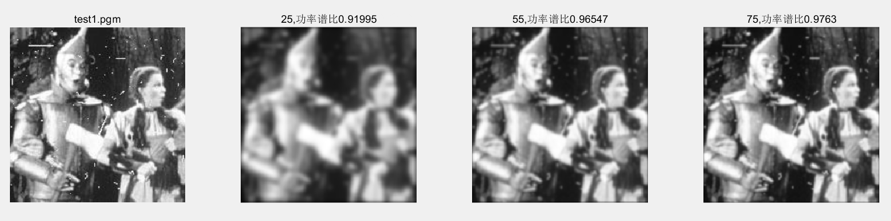

 
 
# 数字图像处理课程作业实验五

**张程博昊**

**自动化64**

**2160504106**

**2019年3月31日**

比较并讨论空域低通高通滤波（Project3）与频域低通和高通的关系；

## 摘要
此次实验主要设计应用了频域的各种高通、低通滤波器，对不同图像分别进行了平滑、边缘增强处理。并对不同的滤波器进行比较，分析了其优缺点及适用范围。通过这次实验，对频域滤波有了更深入的了解。

## 实验内容

### 1.频域低通滤波器：设计低通滤波器包括 butterworth and Gaussian (选择合适的半径，计算功率谱比),平滑测试图像test1和2;分析各自优缺点；

在MATLAB中借用fft2(),fftshift（）等函数，编写出两种低通滤波器，得出结果如下：

**结果分析：**

通过以上图片可以看出，图像的平滑效果与生成矩阵的大小和平滑算法均有关系。可以看出，矩阵维数维数越大，平滑效果越明显，滤波能力强，但图像模糊；高斯滤波相较于中值滤波平滑程度更小，但一些噪声无法滤除。因此两种方法各有优劣，可根据实际情况选择滤波器。

### 2.频域高通滤波器：设计高通滤波器包括butterworth and Gaussian，在频域增强边缘。选择半径和计算功率谱比，测试图像test3,4：分析各自优缺点；

根据所给资料，可根据以下公式生成矩阵，并利用卷积函数得到图像。

 
 
图像如下：

 
 
 

**优缺点：**
自己编程得到滤波器：运行速度慢，更为模糊，但对噪声消除效果更好。
MATLAB自身函数：运行速度快，但对噪声消除效果差，对图像影响较小。
 

### 3.其他高通滤波器：拉普拉斯和Unmask，对测试图像test3,4滤波；分析各自优缺点；

通过对算法的原理的学习，用MATLAB编写了USM、Laplace、sobel的处理程序，并与MATLAB自带edge（）函数进行比较，结果如下:
自己编写：

 
 
 

edge函数：
 
  
 
 
 可见自己所写边缘测试效果较好，laplace边缘检测结果有较大差异（对边缘更为敏感），但运行速度较慢。
 
**结果分析：**
USM处理：得到了边缘较清晰的图像，但一些噪声显现明显
三种边缘检测的优缺点：
sobel：边缘较为明显，但边缘线较粗，对噪声、非明显边缘处理较好。
laplace：边缘线较细，效果较差，对噪声抑制效果较差。
canny：边缘线很细，效果对需要边缘很好，但过于敏感，对噪声抑制、非明显边缘的处理很差。

## 附录

代码见文件

## 参考文献

[1] 冈萨雷斯, 数字图像处理（第三版）, 电子工业出版社
[2] Hairong Qi lecture Notes on the Gaussian Distribution
